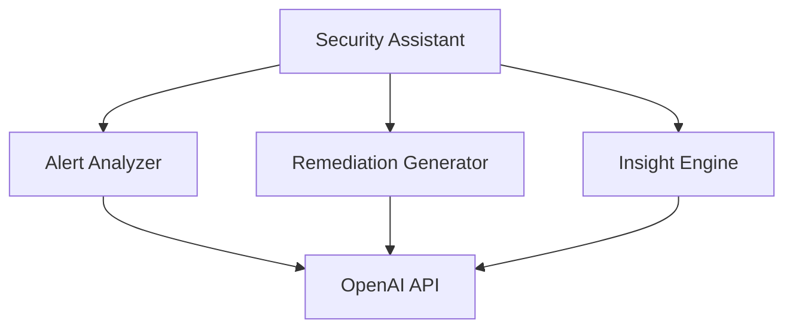
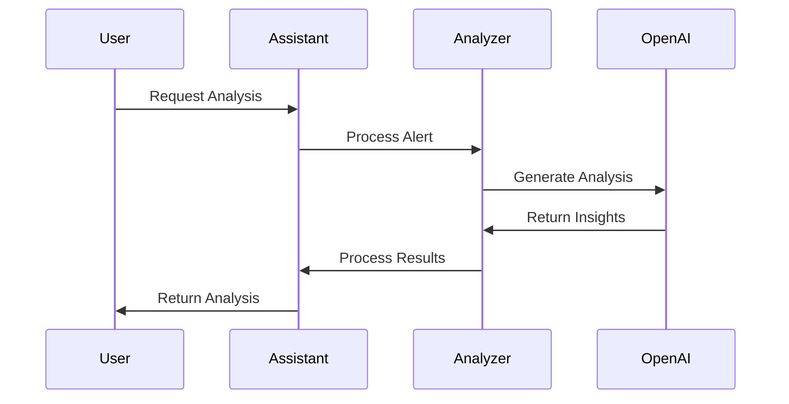

# AI Security Assistant Architecture

## System Architecture

### 1. Component Overview


### 2. Data Flow


## Component Details

### 1. Security Assistant
- Central coordination
- Request handling
- Response aggregation
- Error management

### 2. Alert Analyzer
- Alert context analysis
- Severity assessment
- Impact evaluation
- Related issue detection

### 3. Remediation Generator
- Step generation
- Automation assessment
- Priority calculation
- Validation steps

### 4. Insight Engine
- Risk analysis
- Business impact assessment
- Trend analysis
- Rule optimization

## Integration Points

### 1. OpenAI Integration
```typescript
const openai = new OpenAI({ apiKey });

const completion = await openai.chat.completions.create({
  model: "gpt-4",
  messages: [
    {
      role: "system",
      content: "You are a security expert..."
    },
    {
      role: "user",
      content: prompt
    }
  ]
});
```

### 2. Alert System Integration
```typescript
interface AlertSystem {
  getAlertData(alertId: string): Promise<AlertData>;
  updateAlert(alertId: string, analysis: AIAnalysis): Promise<void>;
}
```

### 3. Remediation System Integration
```typescript
interface RemediationSystem {
  createRemediationPlan(plan: RemediationPlan): Promise<void>;
  trackRemediation(planId: string): Promise<RemediationStatus>;
}
```

## Performance Considerations

### 1. Caching Strategy
```typescript
interface CacheConfig {
  ttl: number;
  maxSize: number;
  invalidationRules: InvalidationRule[];
}
```

### 2. Rate Limiting
```typescript
interface RateLimitConfig {
  maxRequests: number;
  windowMs: number;
  errorHandler: (error: Error) => void;
}
```

### 3. Batch Processing
```typescript
interface BatchConfig {
  maxBatchSize: number;
  batchTimeoutMs: number;
  errorThreshold: number;
}
```

## Security Measures

### 1. Data Protection
- Sensitive data filtering
- Response sanitization
- Secure storage

### 2. Access Control
- API key rotation
- Request authentication
- Response validation

### 3. Monitoring
- Request logging
- Error tracking
- Performance metrics