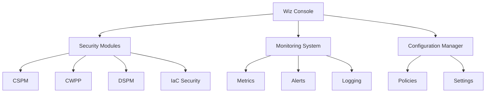

```markdown
# Wiz CNAPP Platform Documentation

## Platform Architecture

### Overview
The Wiz Cloud Native Application Protection Platform (CNAPP) provides comprehensive security coverage through an agentless architecture. Key components include:

1. Core Services
   - Configuration Management
   - Security Scanning
   - Risk Assessment
   - Compliance Monitoring

2. Security Modules
   - CSPM (Cloud Security Posture Management)
   - CWPP (Cloud Workload Protection)
   - DSPM (Data Security Posture Management)
   - IaC (Infrastructure as Code) Security

### System Components



## Implementation Details

### 1. Core Services

#### Configuration Management
```typescript
// src/config/ConfigManager.ts
export class ConfigManager {
  private config: PlatformConfig;
  private validators: ConfigValidator[];

  async loadConfig(environment: string): Promise<void> {
    const configPath = `config/${environment}.yaml`;
    this.config = await this.parseConfig(configPath);
    await this.validateConfig();
  }

  private async validateConfig(): Promise<void> {
    for (const validator of this.validators) {
      await validator.validate(this.config);
    }
  }
}
```

#### Security Service
```typescript
// src/security/SecurityService.ts
export class SecurityService {
  private scanners: Scanner[];
  private riskAssessor: RiskAssessor;

  async performSecurityCheck(): Promise<SecurityReport> {
    const findings = await this.runScanners();
    const risks = await this.assessRisks(findings);
    return this.generateReport(findings, risks);
  }

  private async runScanners(): Promise<Finding[]> {
    return Promise.all(
      this.scanners.map(scanner => scanner.scan())
    );
  }
}
```

### 2. Security Modules

#### CSPM Implementation
```yaml
# config/cspm.yaml
cspm:
  scanning:
    interval: 3600
    parallel_scans: 10
  
  resources:
    compute:
      enabled: true
      types: [vm, container, serverless]
    storage:
      enabled: true
      types: [block, object, database]
    network:
      enabled: true
      types: [vpc, security_groups, load_balancers]

  compliance:
    frameworks:
      - name: cis-aws
        version: "1.4"
      - name: pci-dss
        version: "3.2.1"
```

#### CWPP Configuration
```yaml
# config/cwpp.yaml
cwpp:
  runtime:
    monitoring:
      enabled: true
      interval: 60
    protection:
      enabled: true
      mode: prevent

  vulnerability:
    scanning:
      enabled: true
      severity_threshold: high
    management:
      auto_remediation: true
      exception_workflow: true

  container:
    registry_scanning: true
    runtime_scanning: true
    admission_control: true
```

### 3. Monitoring System

#### Metrics Collection
```typescript
// src/monitoring/MetricsCollector.ts
export class MetricsCollector {
  private registry: MetricRegistry;
  private exporters: MetricExporter[];

  async collectMetrics(): Promise<void> {
    const metrics = await this.gatherMetrics();
    await this.processMetrics(metrics);
    await this.exportMetrics(metrics);
  }

  private async gatherMetrics(): Promise<Metric[]> {
    return Promise.all([
      this.collectSecurityMetrics(),
      this.collectPerformanceMetrics(),
      this.collectComplianceMetrics()
    ]);
  }
}
```

#### Alert Configuration
```yaml
# config/alerts.yaml
alerts:
  providers:
    slack:
      enabled: true
      channels:
        critical: "#security-critical"
        high: "#security-alerts"
    email:
      enabled: true
      recipients:
        - security-team@company.com
  
  rules:
    - name: critical_vulnerability
      condition: "vulnerability_count{severity='critical'} > 0"
      duration: "5m"
      severity: critical
      channels: [slack.critical, email]

    - name: compliance_breach
      condition: "compliance_score < 80"
      duration: "1h"
      severity: high
      channels: [slack.high, email]
```

### 4. Integration Features

#### Cloud Provider Integration
```typescript
// src/integrations/CloudProviderIntegration.ts
export class CloudProviderIntegration {
  private providers: CloudProvider[];

  async setupIntegration(provider: string): Promise<void> {
    const config = await this.loadProviderConfig(provider);
    await this.validateCredentials(config);
    await this.enableIntegration(config);
  }

  private async validateCredentials(config: ProviderConfig): Promise<void> {
    const validator = this.getCredentialValidator(config.type);
    await validator.validate(config.credentials);
  }
}
```

#### CI/CD Integration
```yaml
# config/cicd.yaml
cicd:
  providers:
    gitlab:
      enabled: true
      scan_pipeline: true
    github:
        enabled: true
        scan_pr: true
  
  scanning:
    iac: true
    containers: true
    dependencies: true
  
  policies:
    block_severity: high
    fail_on_vulnerability: true
```

## Best Practices

### 1. Security Implementation

#### Authentication
```typescript
// src/security/AuthManager.ts
export class AuthManager {
  private tokenManager: TokenManager;
  private mfaProvider: MFAProvider;

  async authenticate(credentials: Credentials): Promise<AuthToken> {
    await this.validateCredentials(credentials);
    await this.verifyMFA(credentials);
    return this.tokenManager.generateToken(credentials);
  }

  private async verifyMFA(credentials: Credentials): Promise<void> {
    if (this.mfaRequired(credentials)) {
      await this.mfaProvider.verify(credentials.mfaToken);
    }
  }
}
```

#### Access Control
```yaml
# config/access-control.yaml
rbac:
  roles:
    admin:
      permissions: [read, write, delete]
    auditor:
      permissions: [read]
    operator:
      permissions: [read, write]
  
  policies:
    - name: least-privilege
      enforce: true
    - name: session-timeout
      timeout: 8h
```

### 2. Performance Optimization

#### Resource Management
```typescript
// src/optimization/ResourceManager.ts
export class ResourceManager {
  private metrics: MetricsCollector;
  private limits: ResourceLimits;

  async optimizeResources(): Promise<void> {
    const usage = await this.metrics.getCurrentUsage();
    if (this.shouldOptimize(usage)) {
      await this.performOptimization(usage);
    }
  }

  private async performOptimization(usage: ResourceUsage): Promise<void> {
    await Promise.all([
      this.optimizeCPU(usage.cpu),
      this.optimizeMemory(usage.memory),
      this.optimizeStorage(usage.storage)
    ]);
  }
}
```

[Continue with more sections...]
```